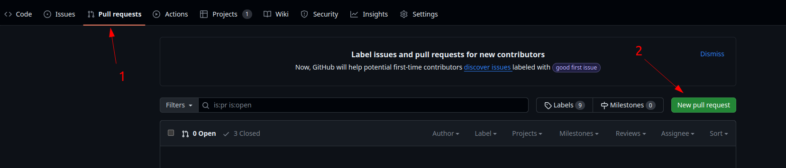
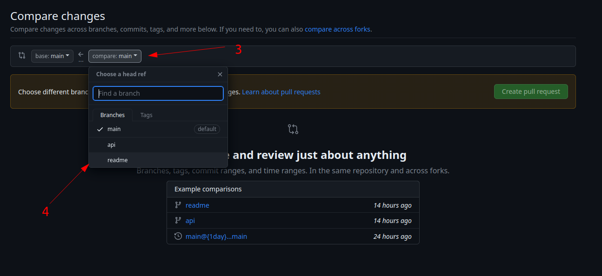
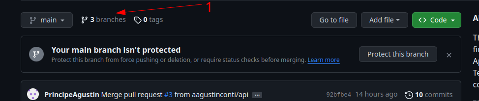
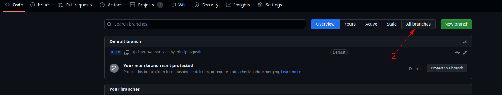

<a name="top"></a>

<!-- PROJECT LOGO -->
<br />
<div align="center">
  <a href="https://github.com/danunziata/tf_tcpip_serra_agustin_2024/tree/main">
  </a>

  <h3 align="center">Trabajo Final - Aplicaciones TCP IP</h3>

  <p align="center">
   <a href="https://github.com/danunziata/tf_tcpip_serra_agustin_2024"><strong>Mirá la documentación acá »</strong> </a>
  </p>
</div>

<!-- TABLE OF CONTENTS -->

  <h3>Tabla de contenidos</h3>
  <ol>
    <li><a href="#sobre-el-proyecto">Sobre el proyecto</a></li>
    <li><a href="#para-comenzar">Para comenzar</a></li>
    <li><a href="#uso">Uso</a></li>
    <li><a href="#roadmap">Roadmap</a></li>
    <li><a href="#contribuir">Contribuir</a></li>
    <li><a href="#licencia">Licencia</a></li>
    <li><a href="#contacto">Contacto</a></li>
    <li><a href="#referencias">Referencias</a></li>
  </ol>


<!-- ABOUT THE PROJECT -->
## Sobre el proyecto

**Digitalización de medidores en el borde con visión por computadora.**

El proyecto busca implementar un sistema de digitalización automática de medidores analógicos utilizando técnicas de visión por computadora en el borde (edge computing). Esta solución permitirá la lectura en tiempo real de instrumentos análogos existentes sin necesidad de reemplazarlos, modernizando así la infraestructura de medición de manera costo-efectiva.

[Back to Top](#top)

### Componentes

Se listan a continuación las tecnologías utilizadas.

* [![Docker][Docker]][Docker-url]
* [![Python][Python]][Python-url]


<!-- GETTING STARTED -->
## Para comenzar

La estructura del repositorio se muestra a continuación

### Estructura
```
├── code
│   └── README.md
├── docs
│   ├── 1-propuesta.md
│   ├── 2-resumen.md
│   ├── 3-introduccion.md
│   ├── 4-desarrollo.md
│   ├── 5-conclusiones.md
│   ├── 6-bibliografia.md
│   ├── 7-anexos.md
│   └── img/
├── images/
│   ├── imagen1.png
│   └── imagen2.png
│   ├── index.md
│   └── SRS__TEMPLATE__rev_01.docx
├── LICENSE
├── mkdocs.yml
├── README.md
└── requirements.txt
```

- **code:** guardar los códigos generados para su aplicación y un README.md que indique como poner en marcha esa aplicación.
- **docs:** archivos para documentar el trabajo realizado.


### Documentación

 1. Clone the repo

```sh
git clone https://github.com/danunziata/...
```

2. instalar paquetes de python necesarios para trabajar en un entorno virtual

```sh
sudo apt install python3-pip -y
```

```sh
python3 -m pip install --upgrade pip
```

```sh
sudo apt install python3-venv -y
```

2. Creamos el entorno local

```sh
python3 -m venv .venv
```
3. Activamos el entorno:

```sh
source mkdocs_env/bin/activate
```
desactivar el entorno virtual
```sh
deactivate
```

4. Instalamos el generador de páginas estáticas MkDocs y el tema mkdocs material:

```sh
pip install -r requirements.txt
```

5. Iniciamos un servidor para que nos muestre como queda 
la web generada 

```sh
mkdocs serve
```

- Si queremos compilar el sitio y obtener los archivos html css y js:
```sh
mkdocs build
```
queda disponible la configuración en la carpeta site


[Back to Top](#top)

<!-- USAGE EXAMPLES -->
## Uso

Describir uso del repositorio para hacer funcionar el repositorio de su desarrollo


[Back to Top](#top)

<!-- ROADMAP -->
## Roadmap

* [ ] Completar la propuesta
* [ ] Completar documetno de diseño docs/SRS__TEMPLATE__rev_01.docx
* [ ] desarrollo del trabajo
* [ ] Redacción final de documentación e informe


[Back to Top](#top)

<!-- CONTRIBUTING -->
## Contribuir

### Flujo de trabajo

El proceso que seguiremos implica utilizar la rama `main` como la rama de **producción** del proyecto. Cualquier nueva funcionalidad o corrección de errores se realizará creando nuevas ramas.

Para incorporar una función en la rama `main`, simplemente se crea un "PR" (Pull Request), que deberá ser aprobado por algún colaborador, cualquier colaborador puede hacerlo, o bien, si no requiere revisión, puede ser aceptado por quien esté incluyendo la funcionalidad.

Es crucial que el nombre de las ramas creadas sea lo más descriptivo posible. Por ejemplo, si trabajamos en una nueva funcionalidad relacionada con la API, la rama se debe llamar `feature-api`. En el caso de tratarse de la corrección de un error en el código de la API, la llamaremos `fix-api`.

Además, se contarán con ramas específicas para la documentación con Mkdocs, denominadas `docs`, y para el README, que se llamará `readme`.

La duración de cada rama dependerá de la necesidad de trabajo. Por ejemplo, las ramas `readme` y `docs` podrían mantenerse en remoto sin eliminarse durante todo el trabajo. Luego, se pueden añadir nuevos commits a ellas y volver a crear un "PR". En contraste, al trabajar con partes de la base de datos o la API, las ramas deberán durar hasta la finalización de la funcionalidad, para luego eliminarse del repositorio remoto y continuar con una nueva rama para cualquier otra nueva característica.

### Creación y publicación de ramas

Para crear una nueva rama desde tu entorno local:

```sh
git checkout -b <nombre-de-la-nueva-rama> <nombre-de-la-rama-origen>
```

Para publicar la nueva rama en el repositorio remoto:

```sh
# en <nombre-de-la-nueva-rama>
git push --set-upstream origin <nombre-de-la-nueva-rama>
```

### Solicitud de PRs

Para solicitar un PR, recomendamos realizarlo directamente desde la interfaz de GitHub.





Finalmente, haz clic en "Create pull request" y espera la aprobación.

### Commits convencionales

Los commits convencionales nos permiten mantener la organización al realizar los commits y facilitan la creación de `releases` de forma automatizada.

Se basan en el uso de palabras clave al inicio del mensaje de cada commit, de la siguiente manera:

* **feat(tema de la modificación): Breve explicación**: Para cambios significativos o nuevas características.
  
* **chore(tema de la modificación): Breve explicación**: Para cambios menores, como modificar una IP para una prueba local.
  
* **fix(tema de la modificación): Breve explicación**: Para correcciones pequeñas, como agregar acentos en la documentación.

Ejemplo:

```
feat(vagrant): Añadiendo archivo de configuración de Vagrant
```

Además, es importante **sectorizar por tema** los commits. Por ejemplo, si tu commit modifica 3 archivos relacionados con la API y uno con la documentación, al realizar el commit de la API, `feat(API)`, **no agregaremos a la etapa de preparación** el archivo de documentación, solo los 3 archivos de la API.

### Eliminación de ramas del repositorio remoto y sincronización del repositorio local

Para eliminar las ramas obsoletas del repositorio remoto, se realizará a través de la interfaz de GitHub, en la sección `Branches`.



Luego, se accede a ver todas las ramas:



Finalmente, se hace clic para eliminar la rama:


Una vez eliminada la rama, si se desea, se puede sincronizar el entorno local siguiendo estos pasos:

* Listar las ramas que pueden ser eliminadas del entorno local:

  ```sh
  git remote prune origin --dry-run
  ```

* Limpiar las referencias locales:

  ```sh
  git remote prune origin
  ```

* Verificar el estado de las ramas locales:

  ```sh
  git branch -a
  ```

  Se comprobará que la rama remota ha sido eliminada, pero la rama local aún permanece.

* Eliminar la rama local:

  ```sh
  git branch -d <nombre-de-la-rama-a-borrar>
  ```

Con estos pasos, el entorno local estará "sincronizado" con el remoto.


<!-- LICENSE -->
## Licencia

Este proyecto se distribuye bajo los términos de la Licencia Pública General de GNU, versión 3.0 (GNU General Public License, version 3.0). Consulta el archivo [LICENSE](LICENSE) para obtener detalles completos.

### Resumen de la Licencia

La Licencia Pública General de GNU, versión 3.0 (GNU GPL-3.0), es una licencia de código abierto que garantiza la libertad de uso, modificación y distribución del software bajo los términos estipulados en la licencia. Requiere que cualquier software derivado se distribuya bajo los mismos términos de la GPL-3.0. Consulta el archivo [LICENSE](LICENSE) para más información sobre los términos y condiciones.

### Aviso de Copyright

El aviso de copyright para este proyecto se encuentra detallado en el archivo [LICENSE](LICENSE).

[Back to Top](#top)

<!-- CONTACT -->
## Contacto

[Back to Top](#top)

<!-- ACKNOWLEDGMENTS -->
## Referencias
[Mkdocs](https://www.mkdocs.org/user-guide/configuration/)
[Mkdocs Material](https://squidfunk.github.io/mkdocs-material/getting-started/)

[Back to Top](#top)

<!-- MARKDOWN LINKS & IMAGES -->
<!-- https://www.markdownguide.org/basic-syntax/#reference-style-links -->
[Docker]: https://img.shields.io/badge/docker-%230db7ed.svg?style=for-the-badge&logo=docker&logoColor=white
[Docker-url]: https://docker.com
[Kubernetes]: https://img.shields.io/badge/kubernetes-326ce5.svg?&style=for-the-badge&logo=kubernetes&logoColor=white
[Kubernetes-url]: https://kubernetes.io
[Python]: https://img.shields.io/badge/Python-FFD43B?style=for-the-badge&logo=python&logoColor=blue
[Python-url]: https://www.python.org/
